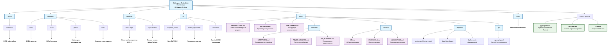

```mermaid
graph TB
    ROOT["<b>ZV-Legacy-Embedded-Erchitecture<br/>AI-Swarm-System/</b>"]
    
    ROOT --> GITHUB[".github/"]
    ROOT --> HARDWARE["hardware/"]
    ROOT --> FIRMWARE["firmware/"]
    ROOT --> AI["ai/"]
    ROOT --> DOCS["docs/"]
    ROOT --> TESTS["tests/"]
    ROOT --> FILES["Файлы проекта"]
    
    GITHUB --> WORKFLOWS["workflows/"]
    WORKFLOWS --> CI_CD["<b>CI/CD пайплайны</b>"]
    
    HARDWARE --> SKIDL["skidl/"]
    SKIDL --> SKIDL_SCRIPTS["<b>SKiDL скрипты</b>"]
    
    HARDWARE --> KICAD["kicad/"]
    KICAD --> KICAD_PROJECTS["<b>KiCad проекты</b>"]
    
    HARDWARE --> GERBER["gerber/"]
    GERBER --> GERBER_FILES["<b>Файлы для производства</b>"]
    
    HARDWARE --> BOM["bom/"]
    BOM --> BOM_FILES["<b>Ведомости материалов</b>"]
    
    FIRMWARE --> STM32["stm32-flight/"]
    STM32 --> FLIGHT_CONTROLLER["<b>Полетный контроллер</b><br/>(C/C++)"]
    
    FIRMWARE --> ESP32["esp32-swarm/"]
    ESP32 --> SWARM_LOGIC["<b>Роевая логика</b><br/>(MicroPython)"]
    
    AI --> CV["computer_vision/"]
    CV --> OPENCV_YOLO["<b>OpenCV/YOLO</b>"]
    
    AI --> SWARM_ALGO["swarm_algorithms/"]
    SWARM_ALGO --> SWARM_ALGORITHMS["<b>Роевые алгоритмы</b>"]
    
    AI --> SIM["simulation/"]
    SIM --> GAZEBO_ROS["<b>Gazebo/ROS2</b><br/>симуляции"]
    
    DOCS --> ARCH_DOC["<b>ARCHITECTURE.md</b><br/>Главный архитектурный документ"]
    
    DOCS --> DECISIONS["<b>DECISIONS.md</b><br/>Архитектурные решения"]
    
    DOCS --> DEPLOYMENT["<b>DEPLOYMENT.md</b><br/>Инструкции развертывания"]
    
    DOCS --> HW_DOCS["hardware/"]
    HW_DOCS --> INTERFACES["<b>INTERFACES.md</b><br/>Аппаратные интерфейсы"]
    
    HW_DOCS --> POWER["<b>POWER_ANALYSIS.md</b><br/>Расчет потребления"]
    
    HW_DOCS --> RF["<b>RF_PLANNING.md</b><br/>Планирование радиоканалов"]
    
    DOCS --> SW_DOCS["software/"]
    SW_DOCS --> API_DOC["<b>API.md</b><br/>API документация"]
    
    SW_DOCS --> PROTOCOLS["<b>PROTOCOLS.md</b><br/>Протоколы связи"]
    
    SW_DOCS --> ALGORITHMS["<b>ALGORITHMS.md</b><br/>Описание алгоритмов"]
    
    DOCS --> DIAGRAMS["diagrams/"]
    DIAGRAMS --> PUML["<b>system-architecture.puml</b>"]
    DIAGRAMS --> DRAWIO["<b>data-flow.drawio</b>"]
    DIAGRAMS --> MMD["<b>deployment-diagram.mmd</b>"]
    
    DOCS --> API_SPEC["api/"]
    API_SPEC --> OPENAPI["<b>openapi.yaml</b><br/>OpenAPI спецификация"]
    
    TESTS --> AUTO_TESTS["<b>Автоматические тесты</b>"]
    
    FILES --> PYPROJECT["<b>pyproject.toml</b><br/>Python зависимости (Poetry)"]
    
    FILES --> README["<b>README.md</b><br/>Главная страница проекта"]
    
    FILES --> LICENSE_FILE["<b>LICENSE</b><br/>Лицензия GPL v3.0"]
    
    %% Стили для лучшей читаемости
    classDef folder fill:#e1f5fe,stroke:#01579b,stroke-width:2px,color:#000000
    classDef file fill:#f3e5f5,stroke:#4a148c,stroke-width:1px,color:#000000
    classDef special fill:#e8f5e8,stroke:#1b5e20,stroke-width:2px,color:#000000
    classDef text fill:#ffffff,stroke:none,color:#000000,font-weight:bold
    
    class ROOT,HARDWARE,FIRMWARE,AI,DOCS,TESTS folder
    class GITHUB,HW_DOCS,SW_DOCS,DIAGRAMS,API_SPEC folder
    class ARCH_DOC,DECISIONS,DEPLOYMENT,INTERFACES,POWER,RF,API_DOC,PROTOCOLS,ALGORITHMS file
    class PYPROJECT,README,LICENSE_FILE special
    
    %% Особые классы для текста
    class CI_CD,SKIDL_SCRIPTS,KICAD_PROJECTS,GERBER_FILES,BOM_FILES,FLIGHT_CONTROLLER,SWARM_LOGIC,OPENCV_YOLO,SWARM_ALGORITHMS,GAZEBO_ROS,AUTO_TESTS text
```
